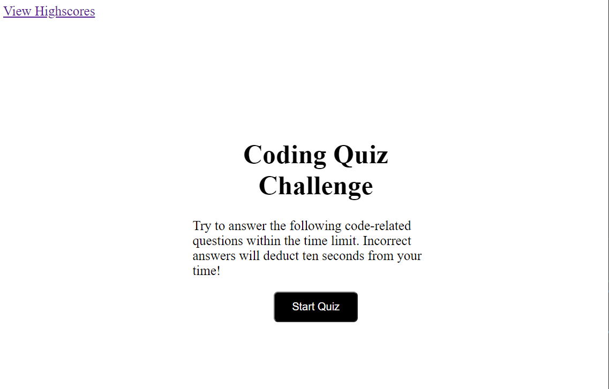
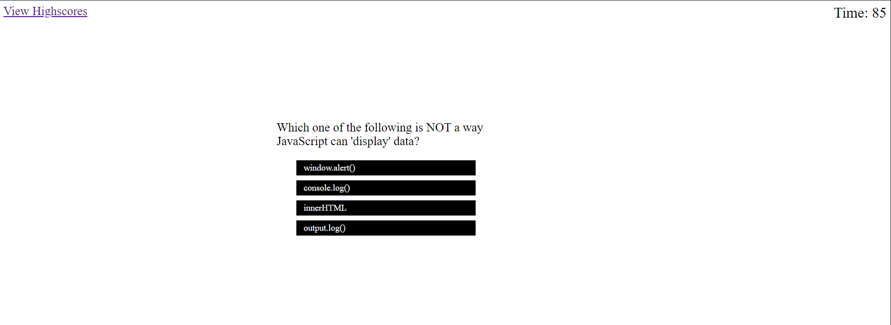
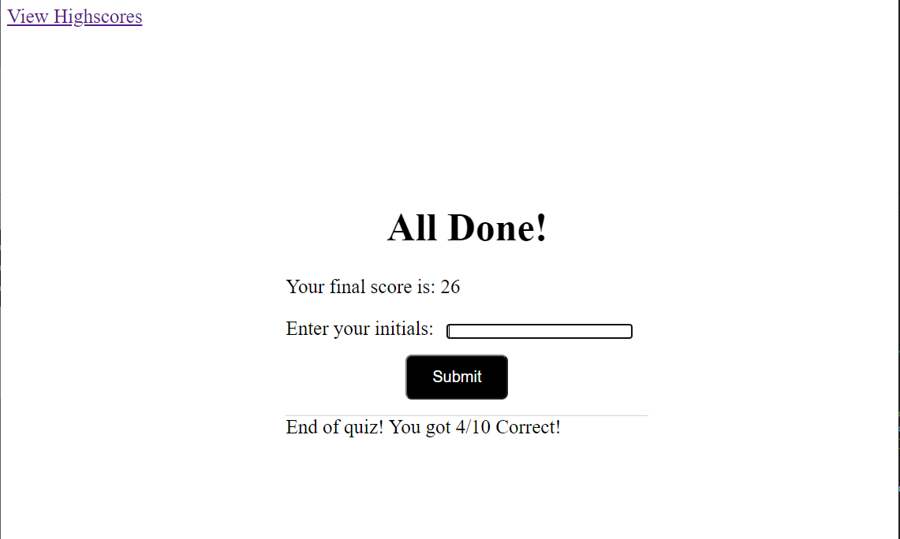
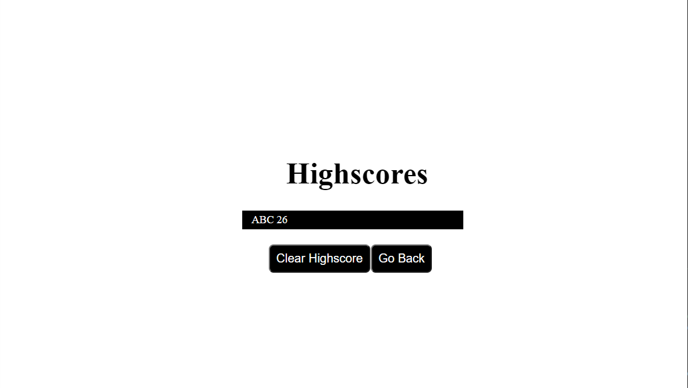

Code Quiz

Live Link: https://jiohc.github.io/code-quiz/

A timed JavaScript coding quiz. 

Click "Start Quiz"

The "View High Scores" link on the top left will direct the user to view all current high scores.

Timer on the top right will start to run.

Total time is 90 second with 10 questions in total.

A series of questions are presented with multiple choice answers.

If the question is answered wrong, 10 seconds will be deducted to the timer.

After a question is answered, whether it is answered correctly or not, it will show the answer at the bottom.

The game is over when all questions are answered or the timer reaches 0.

Score is based on the remaining time. 

When game is over, the user can enter their initials, click "Submit" to save high score to local storage.

The user has the option to click on "Go Back" to start quiz again, or "Clear High Scores" to clear saved scores.

